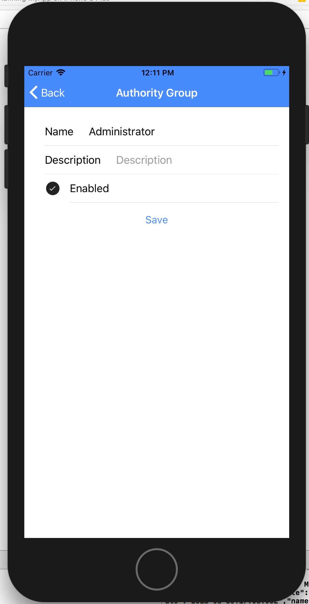

# **Ionic 3**

Example of how to build apps in one codebase, for any platform, with the web. 

## **Prerequisites**

* API based on [ASP.NET Core](https://github.com/jealvarez/dotnet-example-api)
* NodeJs 8+
* TypeScript 2.8+
* Ionic 3

## **Install Dependencies**

* To install dependencies, go to the main directory where is located the `package.json`

```sh
npm install
```

## **Testing**

### **Web Browser**

On the main directory where is located the `package.json`

* To run

```sh
ionic serve
```


## **iOS**

* Add iOS platform

```sh
ionic cordova platform add ios
```

* Open the file `platform/ios/MyApp.xcodeproj`. **Note. You need Xcode**

* Run iOS emulator under Xcode




## **Android**

* Add android platform

```sh
ionic cordova platform add android
```

* Open Android Studio IDE

* Open the project under `platform/android`

* Run android emulator under Android Studio IDE


